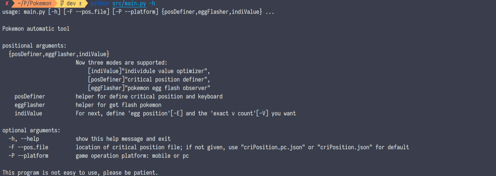
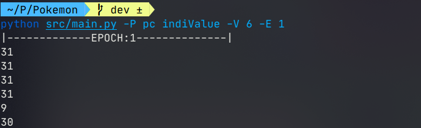
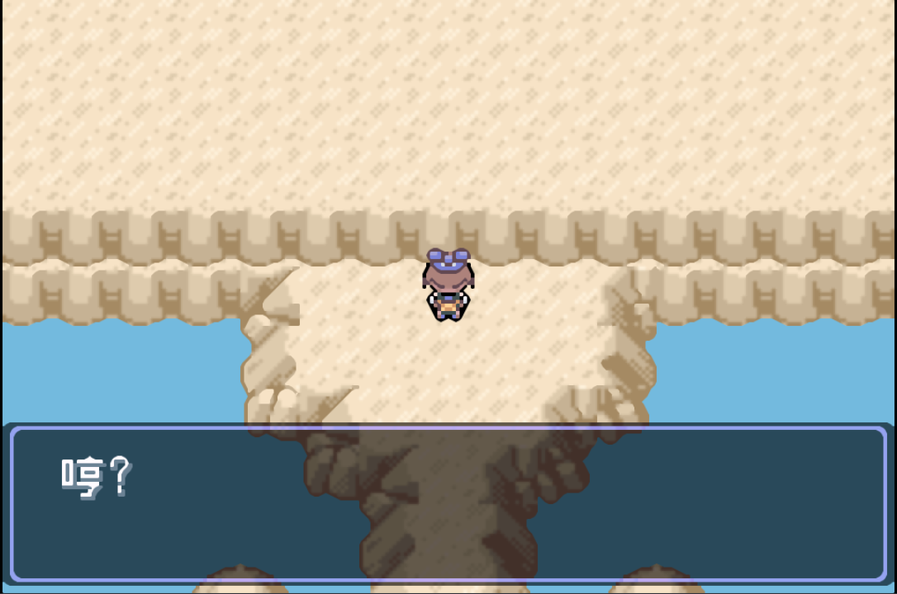
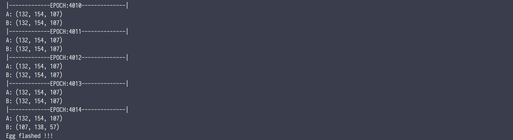

<!-- PROJECT -->

  <h3 align="center">PokemonHelper</h3>

  <p align="center">
    AFK script implemented on GBA monitor platform for Pokémon Emerald and derivative versions

## About The Project

<p align="center"><stong>
    This repository is for own use, therefore, it is not considered to expand the support of other language versions or operating systems
</strong></p>

### Origin

此项目的念头出自本人苦苦挣扎于《漆黑的魅影》的蛋闪的时期。由于蛋闪之出产率远低于可操作的 6v，为蛋闪而奔波的日子无比枯燥且乏味。彼时见到一个基于手机按键精灵的自动蛋闪脚本，私以为在 pc 平台上将会有更大的舞台。

蛋闪脚本的成功激发了自动化的念头，尤其是 6v 的自动化。毕竟在手动操作之下，虽然有红线机制的加入，手动育种的工作仍需要许多代的培育。而一旦可以自动化，利用 6v 父本便可以实现“第一代培养 5v 母本，第二代便出产 6v”的两代流。

但`6v脚本`的复杂度显然远胜于`蛋闪脚本`，因为这需要个体值的识别，此外还需要一些移动换位的操作的调试。这样的程序放在按键精灵脚本上恐怕成本巨大。与之相比，利用 python 开源社区显然是一个更好的选择。

### Feature

**Pokemon Helper**是一个服务于 GBA 环境之下口袋妖怪游戏的 AFK 脚本。换言之本项目工作于第三世代环境下的口袋妖怪及其第三方改版。

自动化体现在两个方面：_6v 孵化_(indiValue)以及*蛋闪孵化*(eggFlasher)。

#### 6v - indiValue

-   6v 脚本基于第三世代下的孵蛋机制：取得蛋之后，个体值才确定。因此，通过在取蛋之前设置保存点，经过不断 solo 是存在产出 6v 的可能的。
-   实现原理：在孵蛋老爷爷以及个体鉴定员之间存在一条 L 型通道(自带位置修正)，那么只需要通过 1.取蛋、2.移位、3.换蛋于首位、4.对话个体鉴定员进行数字识别，共计四步操作的自动化便能够实现 6v 脚本的自动化。
-   工作要求：起始时于正下方面对老爷爷，并调整加速至 10 倍速以上。(建议先行验蛋而后 solo 个体)

#### 蛋闪 - eggFlasher

-   蛋闪脚本基于第三世代下的蛋机制：蛋孵化之时仍存在出现闪光 pokemon 的可能。
-   实现原理： 在孵化后的非蛋闪身上取得一个取色点座标，要求取色点在蛋闪以及非蛋闪身上存在色差。通过比较取色点颜色的差异来判断是否蛋闪。
-   工作要求：起始于在蛋刚孵化（“哼”对话框出现时），并调整加速至 10 倍速以上。（建议先在“哼”处保存，然后在蛋孵出时选择完取色点后重新加载，而后开启脚本）

### Summary

**6v**以及**蛋闪**核心之处，而无论是利用安卓机投屏还是 pc 模拟器，都需要确定`按键映射`。前者需要将按键位置告诉鼠标，后者需要告知按键与键盘的映射关系。而且更有个体值识别需要的识别区域确定、蛋闪需要的蛋闪区域确定。

因此，除却**6v**以及**蛋闪**之外，还加入了 posDefiner 来定位。

## Requirement

-   pytesseract==0.3.4
-   PyAutoGUI==0.9.50
-   Pillow==7.2.0
-   PyYAML==5.3.1

## Startup

1. ```bash
   cd PokemonHelper
   ```

2. ```bash
   python src/main.py -h
   ```



3. Set 'criPosition\*.json‘之 flag 为 false

4. 根据当前平台选择-P desktop 或者-P mobile，而后输入`python src/main.py posDefiner`来确定[按键映射关系](###KeyMap)。

 

5. 选择 indiValue 或者 eggFlasher 之前，使用`python src/main.py posDefiner -A <Indivalue/Flash> `来进一步确定取样位置。

6. 选择 indiValue 或者 eggFlasher 脚本，此前使用`python src/main.py <indiValue/eggFlasher> -h `获取可能的参数帮助

### KeyMap

当前并不支持由 posDefiner 驱动的交互式按键映射确定，也即是当前只能手动在 criPosition.json 之中进行设置.映射所需的按键名称表如下所示：

```
'\t', '\n', '\r', ' ', '!', '"', '#', '$', '%', '&', "'", '(', ')', '*', '+', ',', '-', '.', '/', '0', '1', '2', '3', '4', '5', '6', '7', '8', '9', ':', ';', '<', '=', '>', '?', '@', '[', '\\', ']', '^', '_', '`', 'a', 'b', 'c', 'd', 'e', 'f', 'g', 'h', 'i', 'j', 'k', 'l', 'm', 'n', 'o', 'p', 'q', 'r', 's', 't', 'u', 'v', 'w', 'x', 'y', 'z', '{', '|', '}', '~', 'accept', 'add', 'alt', 'altleft', 'altright', 'apps', 'backspace', 'browserback', 'browserfavorites', 'browserforward', 'browserhome', 'browserrefresh', 'browsersearch', 'browserstop', 'capslock', 'clear', 'convert', 'ctrl', 'ctrlleft', 'ctrlright', 'decimal', 'del', 'delete', 'divide', 'down', 'end', 'enter', 'esc', 'escape', 'execute', 'f1', 'f10', 'f11', 'f12', 'f13', 'f14', 'f15', 'f16', 'f17', 'f18', 'f19', 'f2', 'f20', 'f21', 'f22', 'f23', 'f24', 'f3', 'f4', 'f5', 'f6', 'f7', 'f8', 'f9', 'final', 'fn', 'hanguel', 'hangul', 'hanja', 'help', 'home', 'insert', 'junja', 'kana', 'kanji', 'launchapp1', 'launchapp2', 'launchmail', 'launchmediaselect', 'left', 'modechange', 'multiply', 'nexttrack', 'nonconvert', 'num0', 'num1', 'num2', 'num3', 'num4', 'num5', 'num6', 'num7', 'num8', 'num9', 'numlock', 'pagedown', 'pageup', 'pause', 'pgdn', 'pgup', 'playpause', 'prevtrack', 'print', 'printscreen', 'prntscrn', 'prtsc', 'prtscr', 'return', 'right', 'scrolllock', 'select', 'separator', 'shift', 'shiftleft', 'shiftright', 'sleep', 'space', 'stop', 'subtract', 'tab', 'up', 'volumedown', 'volumemute', 'volumeup', 'win', 'winleft', 'winright', 'yen', 'command', 'option', 'optionleft', 'optionright'
```

## Screenshots

</img>

<p align="center">图 个体脚本起始位置</p>

</img>

<p align="center">图 个体脚本实现效果</p>

</img>

<p align="center">图 蛋闪脚本起始位置</p>

</img>

<p align="center">图 蛋闪脚本实现效果</p>

## TODO:

-   [ ] Crossplatform screenshot function
-   [ ] Add keyboarn map function to positionDefiner
